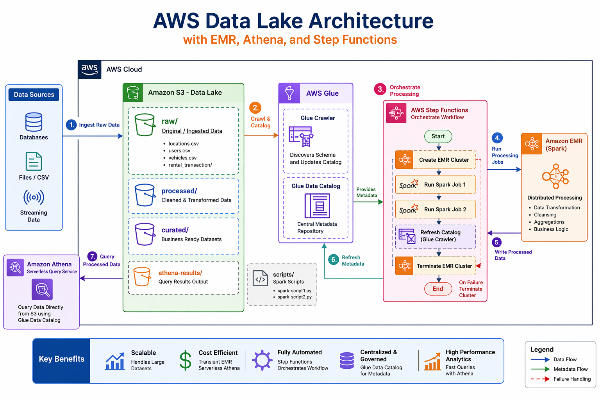

# AWS Data Lake Architecture with EMR, Athena, and Step Functions

## Overview

This project implements a scalable, cost-efficient **AWS-based data lake architecture** designed to process, catalog, and query large datasets.

The solution uses:
- Amazon S3 as the storage layer
- AWS Glue Data Catalog for metadata management
- Amazon EMR (Apache Spark) for distributed data processing
- AWS Step Functions for orchestration
- Amazon Athena for serverless querying

The architecture follows a **transient compute model**, where EMR clusters are created on demand and terminated after processing to optimise cost.

---

## Business Problem

Modern data systems often face:

- Overloaded operational databases (OLTP)
- Slow analytical queries
- Lack of centralized data access
- Poor data discoverability

### Solution

This project addresses these challenges by:

- Decoupling storage from compute
- Creating a centralized data lake
- Enabling serverless querying via Athena
- Automating workflows using Step Functions
- Leveraging distributed processing with Spark

---

## Architecture



### Data Flow

```

S3 (Raw Layer)
↓
Glue Crawler → Data Catalog
↓
Step Functions (Orchestration)
↓
EMR Cluster (Spark Processing)
↓
S3 (Processed / Curated Layers)
↓
Glue Crawler Refresh
↓
Athena (Query Layer)

```

---

## AWS Services Used

| Service | Purpose |
|--------|--------|
| Amazon S3 | Data lake storage (raw, processed, curated) |
| AWS Glue Crawler | Schema inference |
| AWS Glue Data Catalog | Metadata repository |
| Amazon EMR | Distributed Spark processing |
| AWS Step Functions | Workflow orchestration |
| Amazon Athena | Serverless querying |
| IAM | Secure access control |

---

## Project Structure

```

project/
│
├── scripts/                  # Spark processing scripts
├── step_functions/           # Step Function definitions
├── docs/                     # Architecture diagrams
│   └── architecture.png
├── requirements.txt
├── .gitignore
└── README.md

```

---

## Data Lake Structure

```

s3://aws-de-projects-bucket/
│
├── raw/                     # Raw ingested data
│   ├── locations.csv
│   ├── users.csv
│   ├── vehicles.csv
│   └── rental_transactions/
│
├── processed/               # Cleaned data
├── curated/                 # Business-ready datasets
├── scripts/                 # Spark scripts
└── athena-results/          # Athena query outputs

```

---

## Processing Workflow

1. Raw data is ingested into **S3 (raw layer)**
2. Glue Crawlers scan data and update the **Data Catalog**
3. Step Functions orchestrate the pipeline:
   - Create EMR cluster
   - Execute Spark jobs
   - Monitor execution
   - Handle failures
   - Terminate cluster
4. Processed data is written back to S3
5. Glue Crawlers refresh metadata
6. Athena queries processed datasets

---

## Step Functions Workflow

```

Start
↓
Create EMR Cluster
↓
Run Spark Job 1
↓
Run Spark Job 2
↓
Update Catalog (Crawler)
↓
Terminate EMR Cluster
↓
End

```

### Failure Handling

- Any failure triggers cluster termination
- Prevents idle resource cost
- Ensures fault tolerance

---

## EMR Processing

- Uses Apache Spark for distributed computation
- Reads data from S3 raw layer
- Applies transformations and aggregations
- Writes output to processed/curated layers

---

## Athena Query Layer

- Queries data directly from S3
- Uses Glue Data Catalog metadata
- No data movement required
- Pay-per-query pricing model

---

## Security

- IAM roles manage access to:
  - S3
  - EMR
  - Glue
  - Step Functions
- Uses `iam:PassRole` for secure EMR execution
- Supports integration with AWS Lake Formation

---

## Cost Optimisation

- EMR clusters are **ephemeral**
  - Created only when needed
  - Automatically terminated after processing
- Athena uses **serverless pricing**
- S3 provides cost-efficient storage tiers

---

## Key Design Principles

- Separation of storage and compute
- Metadata-driven architecture
- Transient compute model
- Scalable distributed processing
- Serverless analytics layer
- Automated orchestration

---


